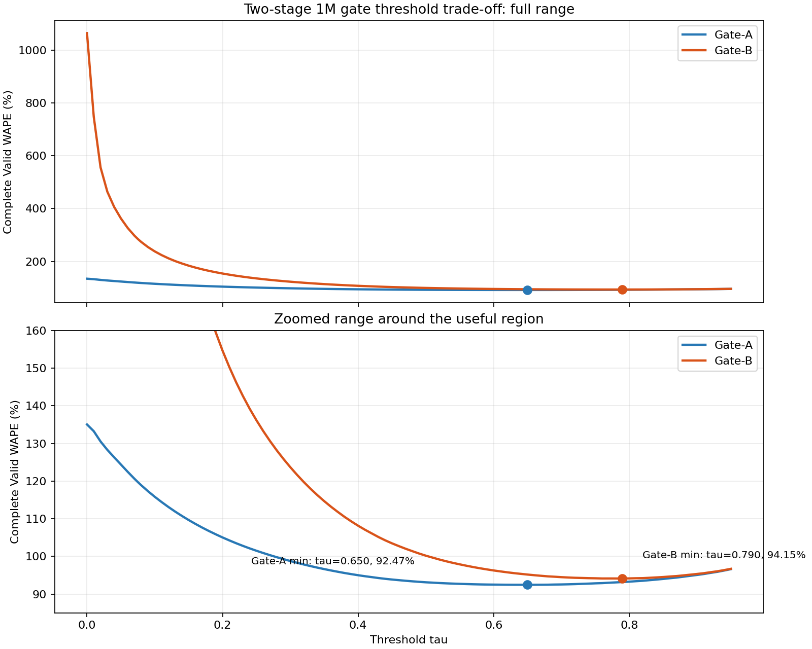
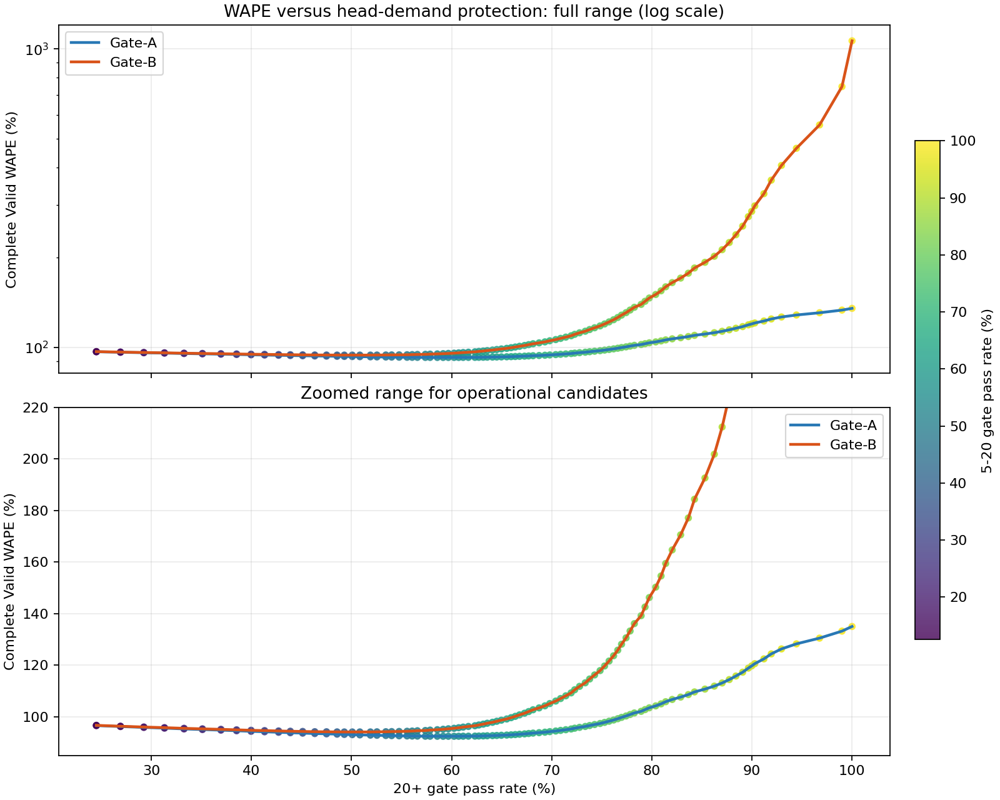

# Two-stage 1M Gate-A / Gate-B Valid Trade-off

本报告仅使用 Active-Store Complete Valid。未使用 Test 选择阈值，也未重新训练任何模型。

## 定义

- Original: `p_sale * conditional_qty`
- Gate-A: `p_sale < tau` 时为 0，否则为 `p_sale * conditional_qty`
- Gate-B: `p_sale < tau` 时为 0，否则为 `conditional_qty`

## 无约束结果

- Original Valid WAPE: 135.0325%
- Gate-A 最低 WAPE: 92.4727%，tau=0.650，5-20通过率=54.75%，20+通过率=59.15%
- Gate-B 最低 WAPE: 94.1460%，tau=0.790，5-20通过率=40.20%，20+通过率=49.28%

完整阈值结果见 `reports/two_stage_gate_1m_tradeoff.csv`。

## 保护水平候选

| 20+最低通过率 | Method | tau | Valid WAPE | 5-20通过率 | 20+通过率 | 总量偏差 |
|---:|---|---:|---:|---:|---:|---:|
| 98% | gate_a | 0.010 | 133.2392% | 99.10% | 98.99% | 7.45% |
| 98% | gate_b | 0.010 | 747.1481% | 99.10% | 98.99% | 688.74% |
| 95% | gate_a | 0.020 | 130.5199% | 98.12% | 96.75% | 4.67% |
| 95% | gate_b | 0.020 | 555.9000% | 98.12% | 96.75% | 493.92% |
| 90% | gate_a | 0.070 | 120.6258% | 93.80% | 90.28% | -6.03% |
| 90% | gate_b | 0.070 | 297.8059% | 93.80% | 90.28% | 221.64% |
| 85% | gate_a | 0.140 | 110.7634% | 88.13% | 85.31% | -18.18% |
| 85% | gate_b | 0.140 | 192.6032% | 88.13% | 85.31% | 99.45% |
| 80% | gate_a | 0.210 | 104.2580% | 83.39% | 80.39% | -27.69% |
| 80% | gate_b | 0.210 | 150.2740% | 83.39% | 80.39% | 43.93% |

各保护水平下最低 WAPE 方案：98%: gate_a (tau=0.010)；95%: gate_a (tau=0.020)；90%: gate_a (tau=0.070)；85%: gate_a (tau=0.140)；80%: gate_a (tau=0.210)。

## Gate-B 分层影响

| 方案 | qty=1 WAPE / MAE | 2-5 WAPE / MAE | 5-20 WAPE | 20+ WAPE | Overall WAPE |
|---|---:|---:|---:|---:|---:|
| Original | 77.48% / 0.775 | 71.12% / 1.765 | 65.12% | 75.11% | 135.03% |
| Gate-B tau=0（全部使用q） | 65.10% / 0.651 | 44.29% / 1.099 | 53.30% | 71.22% | 1063.68% |
| Gate-B无约束最佳 | 104.66% / 1.047 | 98.03% / 2.432 | 76.78% | 77.45% | 94.15% |

Gate-B 在 tau=0 时改善所有正销量分层，但真0样本预测总量达到 24,840,375，使 Overall WAPE 升至 1063.68%。当阈值提高到整体最优点时，qty=1、2-5、5-20、20+ 又全部恶化，说明它通过大量置零换取整体 WAPE，而不是稳定改善正销量预测。

## 高销量低概率样本

| 样本组 | 历史形态 | 数量 | 比例 |
|---|---|---:|---:|
| A_5_20_low_p | other | 3 | 3.00% |
| A_5_20_low_p | sudden_burst_from_low | 93 | 93.00% |
| A_5_20_low_p | volatile_history | 4 | 4.00% |
| B_20plus_low_p | other | 2 | 2.00% |
| B_20plus_low_p | sudden_burst_from_low | 94 | 94.00% |
| B_20plus_low_p | volatile_history | 4 | 4.00% |

低概率高销量样本更多呈现低基数突发或剧烈波动，样本本身难预测，但分类器仍存在不可忽略的头部漏判。

## 诊断结论

当前现象更符合三者共同作用：p_sale 与 conditional_qty 相乘造成的幅度衰减、classifier 对部分真实中高销量样本给出低概率、conditional regressor 对头部数量仍有较大误差。
Gate 后处理能证明组合公式存在可优化空间，但高保护率下的改善幅度和无约束最优点的头部漏杀需要同时考虑。
现有证据不足以把问题归因于 classifier 单一组件；但 q 对真实零样本的巨量高估、p*q 对正销量的幅度衰减，以及硬门控对头部的误杀共同构成了重新训练或联合校准整个 Two-stage 的充分依据。

## 运行信息

- Complete Valid rows: 18,563,573
- Evaluation seconds: 1546.9
- Peak RAM: 0.339 GiB
- Classifier iteration: 914
- Regressor iteration: 790
- Diagnostic sample rows: 200

